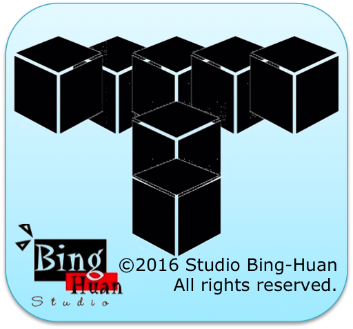

# tetris

 
link to launch to web app: <a href="http://binghuan.github.io/tetris/" target="_blank">http://binghuan.github.io/tetris/</a>

#### There are 5 different pieces in this version of Tetris

and they fall down a 20x20 tetris board:

--------------------------------------------------------------------------------

The game starts with a random piece appearing at the top of the board. The user is then prompted to make a move:  
• (return): move piece left 
• (return): move piece right  
•  (return): rotate piece counter clockwise  
• (return): rotate piece clockwise 

If the move the user selects is valid, then it is executed and the screen redrawn (you can use printf()/cout/System.out.println(), etc to redraw the entire board).

If the action is not valid, then the user is again prompted to enter a valid move. Note that the game only updates after the user has entered a valid action.

A valid move is defined thus: The piece is altered as per the user's input, and then displaced by 1 row downwards.

If the piece, drawn at its new location, is not outside the bounds of the board, and does not overlap any pieces that previously fell, then the move is valid.

If the piece's new position is such that it allows no valid move, then a new piece appears along the top of the board, randomly positioned along the x-axis.

If this new piece happens offer no valid move, then the game is over and the program exits. Good Luck!
